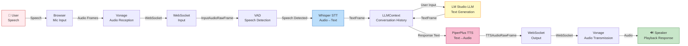

```mermaid
graph LR
    User["🎤 User<br/>Speech"]
    
    Browser["Browser<br/>Mic Input"]
    
    Vonage_In["Vonage<br/>Audio Reception"]
    
    WS_In["WebSocket<br/>Input"]
    
    VAD_Proc["VAD<br/>Speech Detection"]
    
    STT_Proc["Whisper STT<br/>Audio→Text"]
    
    LLMContext["LLMContext<br/>Conversation History"]
    
    LLM_Proc["LM Studio LLM<br/>Text Generation"]
    
    TTS_Proc["PiperPlus TTS<br/>Text→Audio"]
    
    WS_Out["WebSocket<br/>Output"]
    
    Vonage_Out["Vonage<br/>Audio Transmission"]
    
    Speaker["🔊 Speaker<br/>Playback Response"]
    
    User -->|Speech| Browser
    Browser -->|Audio Frames| Vonage_In
    Vonage_In -->|WebSocket| WS_In
    WS_In -->|InputAudioRawFrame| VAD_Proc
    VAD_Proc -->|Speech Detected| STT_Proc
    STT_Proc -->|TextFrame| LLMContext
    LLMContext -->|User Input| LLM_Proc
    LLM_Proc -->|TextFrame| LLMContext
    LLMContext -->|Response Text| TTS_Proc
    TTS_Proc -->|TTSAudioRawFrame| WS_Out
    WS_Out -->|WebSocket| Vonage_Out
    Vonage_Out -->|Audio| Speaker
    
    style User fill:#ffebee,stroke:#c62828
    style Speaker fill:#c8e6c9,stroke:#2e7d32
    style STT_Proc fill:#bbdefb,stroke:#1565c0
    style LLM_Proc fill:#fff9c4,stroke:#f57f17
    style TTS_Proc fill:#f8bbd0,stroke:#c2185b
```
