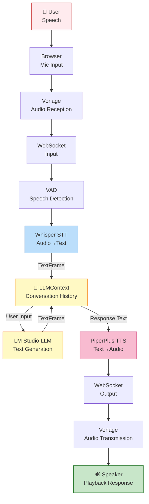

```mermaid
flowchart TB
    User["🎤 User<br/>Speech"] --> Browser["Browser<br/>Mic Input"] --> Vonage_In["Vonage<br/>Audio Reception"] --> WS_In["WebSocket<br/>Input"]
    WS_In --> VAD_Proc["VAD<br/>Speech Detection"] --> STT_Proc["Whisper STT<br/>Audio→Text"]
    STT_Proc -->|TextFrame| LLMContext["🧠 LLMContext<br/>Conversation History"]
    LLMContext -->|User Input| LLM_Proc["LM Studio LLM<br/>Text Generation"]
    LLM_Proc -->|TextFrame| LLMContext
    LLMContext -->|Response Text| TTS_Proc["PiperPlus TTS<br/>Text→Audio"]
    TTS_Proc --> WS_Out["WebSocket<br/>Output"] --> Vonage_Out["Vonage<br/>Audio Transmission"] --> Speaker["🔊 Speaker<br/>Playback Response"]

    style User fill:#ffebee,stroke:#c62828
    style Speaker fill:#c8e6c9,stroke:#2e7d32
    style STT_Proc fill:#bbdefb,stroke:#1565c0
    style LLM_Proc fill:#fff9c4,stroke:#f57f17
    style TTS_Proc fill:#f8bbd0,stroke:#c2185b
    style LLMContext fill:#fff9c4,stroke:#f57f17
```
