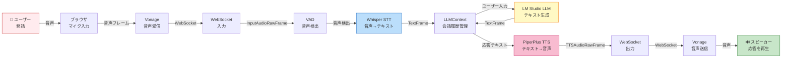

```mermaid
graph LR
    User["🎤 ユーザー<br/>発話"]
    
    Browser["ブラウザ<br/>マイク入力"]
    
    Vonage_In["Vonage<br/>音声受信"]
    
    WS_In["WebSocket<br/>入力"]
    
    VAD_Proc["VAD<br/>音声検出"]
    
    STT_Proc["Whisper STT<br/>音声→テキスト"]
    
    LLMContext["LLMContext<br/>会話履歴管理"]
    
    LLM_Proc["LM Studio LLM<br/>テキスト生成"]
    
    TTS_Proc["PiperPlus TTS<br/>テキスト→音声"]
    
    WS_Out["WebSocket<br/>出力"]
    
    Vonage_Out["Vonage<br/>音声送信"]
    
    Speaker["🔊 スピーカー<br/>応答を再生"]
    
    User -->|音声| Browser
    Browser -->|音声フレーム| Vonage_In
    Vonage_In -->|WebSocket| WS_In
    WS_In -->|InputAudioRawFrame| VAD_Proc
    VAD_Proc -->|音声検出| STT_Proc
    STT_Proc -->|TextFrame| LLMContext
    LLMContext -->|ユーザー入力| LLM_Proc
    LLM_Proc -->|TextFrame| LLMContext
    LLMContext -->|応答テキスト| TTS_Proc
    TTS_Proc -->|TTSAudioRawFrame| WS_Out
    WS_Out -->|WebSocket| Vonage_Out
    Vonage_Out -->|音声| Speaker
    
    style User fill:#ffebee,stroke:#c62828
    style Speaker fill:#c8e6c9,stroke:#2e7d32
    style STT_Proc fill:#bbdefb,stroke:#1565c0
    style LLM_Proc fill:#fff9c4,stroke:#f57f17
    style TTS_Proc fill:#f8bbd0,stroke:#c2185b
```
