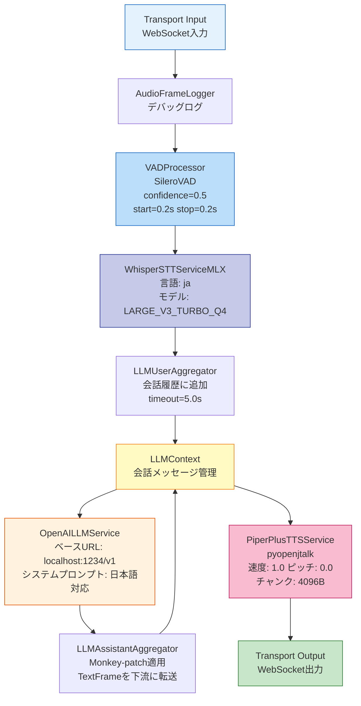

```mermaid
graph TB
    Input["Transport Input<br/>WebSocket入力"]
    
    Log["AudioFrameLogger<br/>デバッグログ"]
    
    VAD["VADProcessor<br/>SileroVAD<br/>confidence=0.5<br/>start=0.2s stop=0.2s"]
    
    STT["WhisperSTTServiceMLX<br/>言語: ja<br/>モデル: LARGE_V3_TURBO_Q4"]
    
    UserAgg["LLMUserAggregator<br/>会話履歴に追加<br/>timeout=5.0s"]
    
    LLM["OpenAILLMService<br/>ベースURL: localhost:1234/v1<br/>システムプロンプト: 日本語対応"]
    
    AssAgg["LLMAssistantAggregator<br/>Monkey-patch適用<br/>TextFrameを下流に転送"]
    
    TTS["PiperPlusTTSService<br/>pyopenjtalk<br/>速度: 1.0 ピッチ: 0.0<br/>チャンク: 4096B"]
    
    Output["Transport Output<br/>WebSocket出力"]
    
    Context["LLMContext<br/>会話メッセージ管理"]
    
    Input --> Log
    Log --> VAD
    VAD --> STT
    STT --> UserAgg
    UserAgg --> Context
    Context --> LLM
    LLM --> AssAgg
    AssAgg --> Context
    Context --> TTS
    TTS --> Output
    
    style Input fill:#e3f2fd,stroke:#1565c0
    style Output fill:#c8e6c9,stroke:#2e7d32
    style Context fill:#fff9c4,stroke:#f57f17
    style VAD fill:#bbdefb,stroke:#1565c0
    style STT fill:#c5cae9,stroke:#283593
    style LLM fill:#fff3e0,stroke:#e65100
    style TTS fill:#f8bbd0,stroke:#c2185b
```
