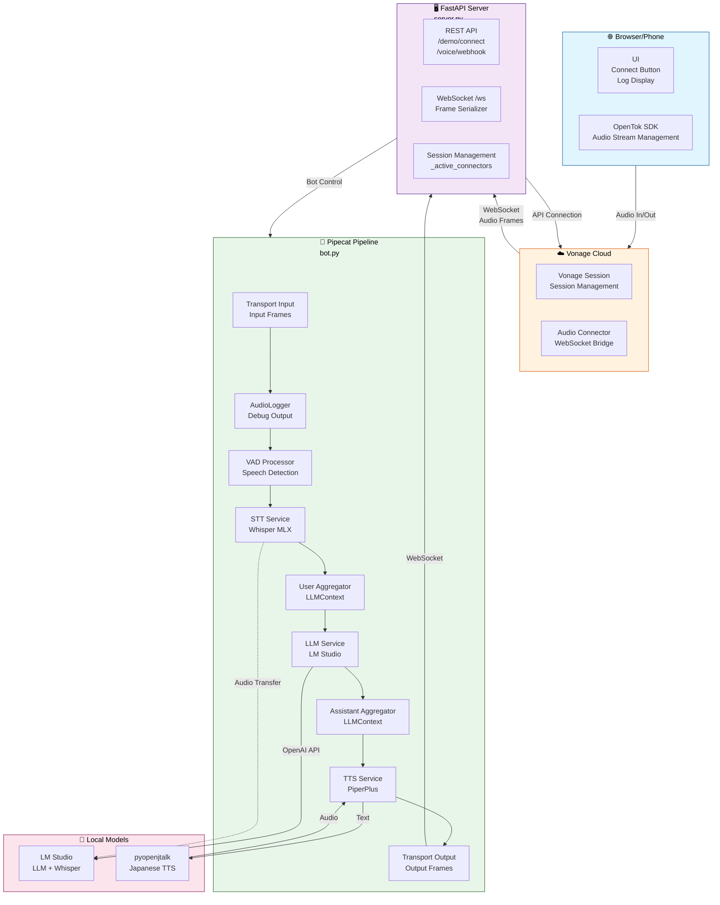

```mermaid
graph TB
    subgraph Browser["🌐 Browser/Phone"]
        UI["UI<br/>Connect Button<br/>Log Display"]
        OpenTok["OpenTok SDK<br/>Audio Stream Management"]
    end
    
    subgraph Vonage["☁️ Vonage Cloud"]
        Session["Vonage Session<br/>Session Management"]
        AudioConnector["Audio Connector<br/>WebSocket Bridge"]
    end
    
    subgraph Server["🖥️ FastAPI Server<br/>server.py"]
        REST["REST API<br/>/demo/connect<br/>/voice/webhook"]
        WebSocket["WebSocket /ws<br/>Frame Serializer"]
        SessionMgmt["Session Management<br/>_active_connectors"]
    end
    
    subgraph Pipeline["🔧 Pipecat Pipeline<br/>bot.py"]
        Transport["Transport Input<br/>Input Frames"]
        AudioLogger["AudioLogger<br/>Debug Output"]
        VAD["VAD Processor<br/>Speech Detection"]
        STT["STT Service<br/>Whisper MLX"]
        UserAgg["User Aggregator<br/>LLMContext"]
        LLM["LLM Service<br/>LM Studio"]
        AssAgg["Assistant Aggregator<br/>LLMContext"]
        TTS["TTS Service<br/>PiperPlus"]
        TransportOut["Transport Output<br/>Output Frames"]
    end
    
    subgraph LocalModels["💾 Local Models"]
        LMStudio["LM Studio<br/>LLM + Whisper"]
        PyOpenJTalk["pyopenjtalk<br/>Japanese TTS"]
    end
    
    Browser -->|Audio In/Out| Vonage
    Vonage -->|WebSocket<br/>Audio Frames| Server
    Server -->|API Connection| Vonage
    Server -->|Bot Control| Pipeline
    
    Transport --> AudioLogger
    AudioLogger --> VAD
    VAD --> STT
    STT --> UserAgg
    UserAgg --> LLM
    LLM --> AssAgg
    AssAgg --> TTS
    TTS --> TransportOut
    TransportOut -->|WebSocket| Server
    
    LLM -->|OpenAI API| LMStudio
    STT -.->|Audio Transfer| LMStudio
    TTS -->|Text| PyOpenJTalk
    PyOpenJTalk -->|Audio| TTS
    
    style Browser fill:#e1f5ff,stroke:#01579b,color:#000
    style Vonage fill:#fff3e0,stroke:#e65100,color:#000
    style Server fill:#f3e5f5,stroke:#4a148c,color:#000
    style Pipeline fill:#e8f5e9,stroke:#1b5e20,color:#000
    style LocalModels fill:#fce4ec,stroke:#880e4f,color:#000
```
