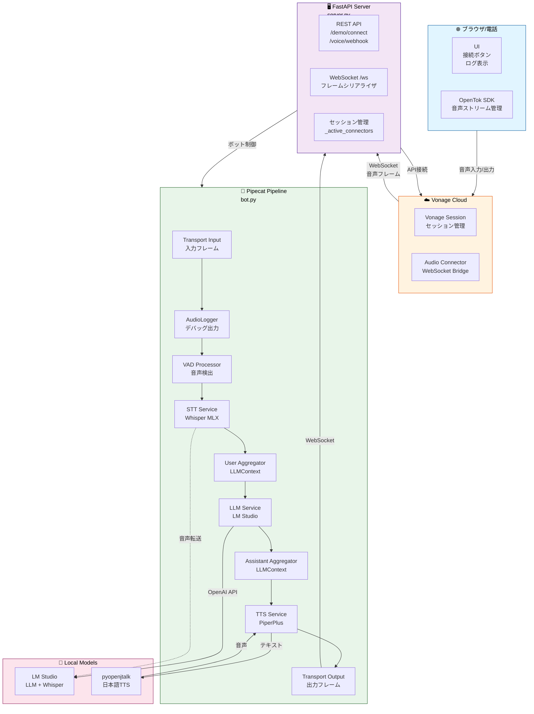

```mermaid
graph TB
    subgraph Browser["🌐 ブラウザ/電話"]
        UI["UI<br/>接続ボタン<br/>ログ表示"]
        OpenTok["OpenTok SDK<br/>音声ストリーム管理"]
    end
    
    subgraph Vonage["☁️ Vonage Cloud"]
        Session["Vonage Session<br/>セッション管理"]
        AudioConnector["Audio Connector<br/>WebSocket Bridge"]
    end
    
    subgraph Server["🖥️ FastAPI Server<br/>server.py"]
        REST["REST API<br/>/demo/connect<br/>/voice/webhook"]
        WebSocket["WebSocket /ws<br/>フレームシリアライザ"]
        SessionMgmt["セッション管理<br/>_active_connectors"]
    end
    
    subgraph Pipeline["🔧 Pipecat Pipeline<br/>bot.py"]
        Transport["Transport Input<br/>入力フレーム"]
        AudioLogger["AudioLogger<br/>デバッグ出力"]
        VAD["VAD Processor<br/>音声検出"]
        STT["STT Service<br/>Whisper MLX"]
        UserAgg["User Aggregator<br/>LLMContext"]
        LLM["LLM Service<br/>LM Studio"]
        AssAgg["Assistant Aggregator<br/>LLMContext"]
        TTS["TTS Service<br/>PiperPlus"]
        TransportOut["Transport Output<br/>出力フレーム"]
    end
    
    subgraph LocalModels["💾 Local Models"]
        LMStudio["LM Studio<br/>LLM + Whisper"]
        PyOpenJTalk["pyopenjtalk<br/>日本語TTS"]
    end
    
    Browser -->|音声入力/出力| Vonage
    Vonage -->|WebSocket<br/>音声フレーム| Server
    Server -->|API接続| Vonage
    Server -->|ボット制御| Pipeline
    
    Transport --> AudioLogger
    AudioLogger --> VAD
    VAD --> STT
    STT --> UserAgg
    UserAgg --> LLM
    LLM --> AssAgg
    AssAgg --> TTS
    TTS --> TransportOut
    TransportOut -->|WebSocket| Server
    
    LLM -->|OpenAI API| LMStudio
    STT -.->|音声転送| LMStudio
    TTS -->|テキスト| PyOpenJTalk
    PyOpenJTalk -->|音声| TTS
    
    style Browser fill:#e1f5ff,stroke:#01579b,color:#000
    style Vonage fill:#fff3e0,stroke:#e65100,color:#000
    style Server fill:#f3e5f5,stroke:#4a148c,color:#000
    style Pipeline fill:#e8f5e9,stroke:#1b5e20,color:#000
    style LocalModels fill:#fce4ec,stroke:#880e4f,color:#000
```
